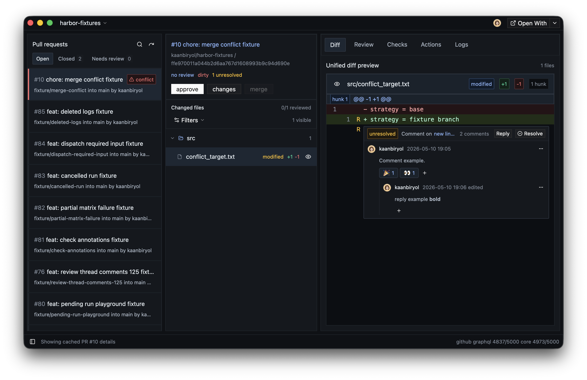

# Harbor



Harbor is a native Rust app for GitHub.com pull request workflows. It helps you review changes, track checks, inspect workflow logs and manage review threads.

It is designed for fast review workflows: repository switching, pull request
inboxes, changed file navigation, diff review threads, pending review
submission, workflow runs, logs, checks, local PR worktrees, and editor handoff.

## Status

Harbor is early software. The core app builds and has a growing test suite, but
it is not packaged for end-user installation yet.

Harbor is currently tested and supported on macOS only. Other platforms may
build, but they are not tested or supported yet.

## Requirements

- macOS
- Rust `1.90` or newer
- A working system toolchain for GPUI
- GitHub CLI, if you want to authenticate through `gh`

## Install

Harbor does not have a packaged macOS app release yet. The intended release path
is a zipped `Harbor.app` that can be copied into `/Applications`.

Until then, install the command-line launcher from source with Cargo:

```bash
cargo install --git https://github.com/kaanbiryol/harbor --locked --bin harbor harbor-app
```

Then run:

```bash
harbor
```

To build a local macOS app bundle:

```bash
script/package-macos
open target/macos/Harbor.app
```

The packaging script also creates `target/macos/Harbor-0.1.0-macos.zip`, which
is the artifact that should be attached to a GitHub release once app signing and
release validation are ready. Public macOS app releases should be signed and
notarized before publishing.

## Run From Source

```bash
cargo run -p harbor-app --bin harbor --locked
```

On first launch, Harbor asks you to connect GitHub.

The easiest path is GitHub CLI auth:

```bash
gh auth login
```

Then choose **Use GitHub CLI** in Harbor.

OAuth device login is also supported. Choose **Continue with GitHub** and Harbor
will open GitHub's device login flow in your browser.

The OAuth flow requests `repo` and `read:org` scopes. Harbor uses its built-in
public OAuth Client ID by default. To test a custom OAuth app, override it with:

```bash
HARBOR_GITHUB_OAUTH_CLIENT_ID=your_client_id cargo run -p harbor-app
```

## Development

Run the standard checks before handing off changes:

```bash
cargo fmt --all
cargo test --workspace
cargo clippy --workspace --all-targets
```

There is also a local clippy helper:

```bash
script/clippy
```

## Workspace Layout

- `crates/app`: GPUI application entrypoint and startup wiring
- `crates/ui`: workspace UI, panels, commands, rendering, and interaction state
- `crates/domain`: stable app models independent from GitHub wire formats
- `crates/github`: GitHub REST/GraphQL clients, DTOs, pagination, and transports
- `crates/git`: local Git repository and worktree operations
- `crates/storage`: SQLite cache, recent repositories, and persisted UI state
- `crates/sync`: background refresh policy and inbox change detection
- `crates/logs`: GitHub Actions log parsing

## License

Harbor is licensed under the MIT License. See [LICENSE](LICENSE).

Third-party dependencies are distributed under their own licenses.
